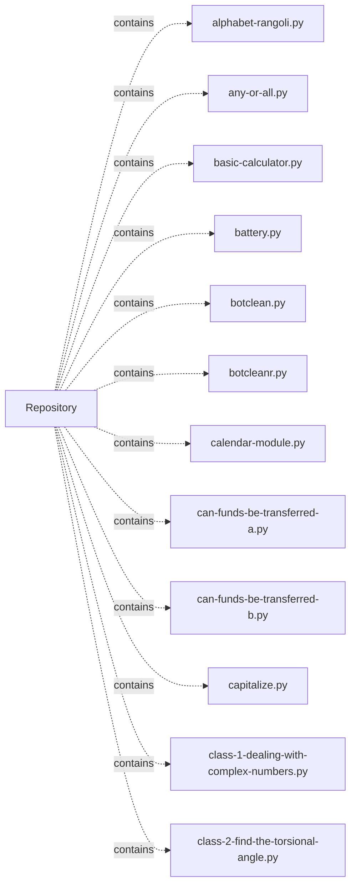

# hackerrank — project architecture

[README](README.md) · [Interview questions and answers](INTERVIEW_QA.md)

## Purpose and scope

A collection of programming, algorithms, data structures, SQL, and interview-practice solutions from HackerRank.

This document describes files and symbols in this checkout. Deployment templates and statements in the original overview are distinguished from a verified running environment.

## Component diagram



For Python repositories, arrows show resolved local imports, not network calls or deployment order. Otherwise the diagram is a repository component map; containment arrows do not assert runtime integration.

## Components and responsibilities

| Component | Responsibility |
| --- | --- |
| [`can-funds-be-transferred-b.py`](can-funds-be-transferred-b.py) | Functions: `init_server`, `process_client_connection`, `compute_distance`, `find_path` |
| [`can-funds-be-transferred-a.py`](can-funds-be-transferred-a.py) | Functions: `init_server`, `process_client_connection`, `compute_distance`, `find_path`, `read_string_from_socket`, `write_string_to_socket`, `main` |
| [`piling-up.py`](piling-up.py) | Functions: `is_valid`, `main` |
| [`2d-array/Solution.java`](2d-array/Solution.java) | Implementation or supporting configuration |
| [`30-2d-arrays/Solution.java`](30-2d-arrays/Solution.java) | Implementation or supporting configuration |
| [`30-abstract-classes/Solution.java`](30-abstract-classes/Solution.java) | Implementation or supporting configuration |
| [`30-arrays/Solution.java`](30-arrays/Solution.java) | Implementation or supporting configuration |
| [`30-binary-numbers/Solution.java`](30-binary-numbers/Solution.java) | Implementation or supporting configuration |
| [`alphabet-rangoli.py`](alphabet-rangoli.py) | Functions: `main` |
| [`any-or-all.py`](any-or-all.py) | Functions: `solve`, `main` |
| [`awk-1.sh`](awk-1.sh) | Implementation or supporting configuration |
| [`awk-2.sh`](awk-2.sh) | Implementation or supporting configuration |
| [`awk-3.sh`](awk-3.sh) | Implementation or supporting configuration |
| [`awk-4.sh`](awk-4.sh) | Implementation or supporting configuration |
| [`bash-tutorials---a-personalized-echo.sh`](bash-tutorials---a-personalized-echo.sh) | Implementation or supporting configuration |
| [`bash-tutorials---arithmetic-operations.sh`](bash-tutorials---arithmetic-operations.sh) | Implementation or supporting configuration |
| [`README.md`](README.md) | Project explanations or operating notes |

## Implementation walkthrough

### `process_client_connection(connection)`

Source: [`can-funds-be-transferred-b.py`](can-funds-be-transferred-b.py#L38).

Calls visible in this function: `compute_distance`, `float`, `map`, `message.split`, `pow`, `print`, `read_string_from_socket`, `read_string_from_socket(connection).decode`, `result.encode`, `write_string_to_socket`.

```python
def process_client_connection(connection):
    while True:
        # read message
        message = read_string_from_socket(connection).decode()

        print("Message received = ", message)

        if message == "END":
            result = message
        else:
            fields = message.split(",")
            a, b = map(int, fields[:2])
            q1 = float(fields[2])
            q = pow(10, q1)

            result = "YES" if compute_distance(a, b) > q else "NO"

        # write message
        write_string_to_socket(connection, result.encode())

        if message == "END":
            break
```

### `process_client_connection(connection)`

Source: [`can-funds-be-transferred-a.py`](can-funds-be-transferred-a.py#L28).

Calls visible in this function: `compute_distance`, `map`, `message.split`, `print`, `read_string_from_socket`, `read_string_from_socket(connection).decode`, `result.encode`, `write_string_to_socket`.

```python
def process_client_connection(connection):
    while True:
        # read message 
        message = read_string_from_socket(connection).decode()

        print ("Message received = ", message)
        
        if message == "END":
            result = message
        else:
            a, b, q = map(int, message.split(","))
            result = "YES" if compute_distance(a, b) <= q else "NO"

        # write message
        write_string_to_socket(connection, result.encode())

        if message == "END":
            break
```

### `is_valid(side_lengths)`

Source: [`piling-up.py`](piling-up.py#L3).

Calls visible in this function: `len`, `max`.

```python
def is_valid(side_lengths):
    left_index = 0
    right_index = len(side_lengths) - 1
    prev_length = max(side_lengths[left_index], side_lengths[right_index])
    while left_index <= right_index:
        length = max(side_lengths[left_index], side_lengths[right_index])
        if length > prev_length:
            return False
        prev_length = length
        if side_lengths[left_index] == length:
            left_index += 1
        else:
            right_index -= 1
    return True
```

### `init_server()`

Source: [`can-funds-be-transferred-b.py`](can-funds-be-transferred-b.py#L20).

Calls visible in this function: `f.readline`, `f.readline().split`, `int`, `map`, `open`, `print`, `range`.

```python
def init_server():
    global parents, parent_probs

    print("Reading training set")

    f = open("training.txt")
    N = int(f.readline())
    parents = [None] * (N + 1)
    parent_probs = [None] * (N + 1)
    for _ in range(N - 1):
        u, v, p = map(int, f.readline().split(","))
        parents[v] = u
        parent_probs[v] = p / 100
```

## Data flow and design decisions

### What is the input-to-output contract of `process_client_connection`

In [`can-funds-be-transferred-b.py`](can-funds-be-transferred-b.py#L38), `process_client_connection(connection)` receives the inputs. The function computes these intermediate values:

The implementation delegates or iterates directly; trace the calls in the source walkthrough.

### Which decision rules or boundary conditions should an interviewer challenge

The implementation in [`can-funds-be-transferred-b.py`](can-funds-be-transferred-b.py#L38) branches on:

- `message == 'END'`
- `message == 'END'`

A useful extension is a table-driven test that covers each condition just below, at, and above its boundary where applicable. These expressions are the current rules; changing them changes behavior and should be justified by the project’s acceptance criteria.

### What does `js10-arithmetic-operators.js` own

[`js10-arithmetic-operators.js`](js10-arithmetic-operators.js) defines `readLine`, `getArea`, `getPerimeter`, `main`.

Trace these definitions and imports to explain the module boundary. Relative imports identify project code; package imports should be checked against the nearest manifest.

### What does `js10-arrays.js` own

[`js10-arrays.js`](js10-arrays.js) defines `readLine`, `getSecondLargest`, `main`.

Trace these definitions and imports to explain the module boundary. Relative imports identify project code; package imports should be checked against the nearest manifest.

## Setup and verification

Follow the existing README and the component-specific instructions linked above. No new application start command is asserted for this repository.

No dedicated test files were found in the inspected first-party file inventory. A future implementation should add executable acceptance checks.

## Operating boundaries and design review

Before turning this checkout into a customer deployment, establish the input contract, data ownership, access controls, failure response, evaluation criteria, and rollback owner. Repository fixtures and unit tests demonstrate local behavior; they do not establish throughput, uptime, compliance, or business impact.

A useful architecture review starts with the linked implementation: identify where input enters, where a decision is made, which state can change, and which external dependency can fail. Add a deployment view only for infrastructure that is actually configured and exercised.
